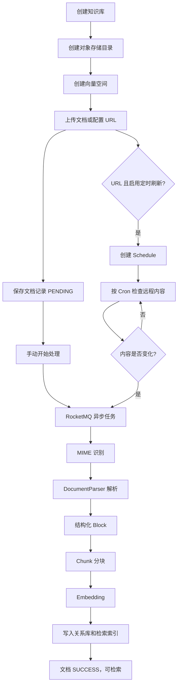

# 知识库管理业务流程

## 1. 文档目的

本文档描述 Ragent 知识库管理的业务边界、核心操作、状态流转、异步任务、定时刷新和数据一致性规则，作为前后端联调、测试用例设计和后续实现调整的业务参考。

## 2. 业务范围

知识库管理包括以下能力：

- 知识库创建、查询、重命名、配置更新和删除。
- 文档上传、查询、修改、处理、启用、禁用和删除。
- URL 文档的定时刷新。
- 文档 Chunk 的查询、新增、修改、删除、启用和禁用。
- 原始文件、关系库记录、向量索引和关键词索引之间的同步。
- 管理操作的业务变更审计。

## 3. 核心对象

| 对象 | 业务职责 |
| --- | --- |
| Knowledge Base | 定义知识空间、Collection 和 Embedding 模型 |
| Document | 保存原始文件及其来源、处理方式和处理状态 |
| Chunk | 文档经过解析和分块后形成的最小检索单元 |
| Vector Space | 保存 Chunk 的向量表示，供向量检索使用 |
| Schedule | 保存 URL 文档的定时刷新规则和执行状态 |
| Chunk Log | 记录文档解析、分块、Embedding 和索引耗时及错误 |

## 4. 总体流程



## 5. 创建知识库

### 5.1 请求

```http
POST /knowledge-base
```

### 5.2 处理规则

1. 校验知识库名称唯一。
2. 校验 Collection 名称唯一。
3. 写入知识库记录。
4. 创建对象存储中的知识库目录。
5. 创建向量空间。
6. 写入业务变更审计日志。
7. 返回知识库 ID。

知识库的 Embedding 模型属于知识库级配置。只要该知识库下已经存在完成向量化的文档，就不允许直接修改 Embedding 模型，避免同一向量空间混用不同模型生成的向量。

实现参考：`rag/src/main/java/com/nageoffer/ai/ragent/knowledge/service/impl/KnowledgeBaseServiceImpl.java`。

## 6. 知识库查询和更新

### 6.1 查询

```http
GET /knowledge-base
GET /knowledge-base/{kb-id}
```

列表查询支持按名称分页，并统计知识库下未删除文档数量。详情查询只返回有效知识库。

### 6.2 重命名或更新

```http
PUT /knowledge-base/{kb-id}
```

处理规则：

1. 校验知识库存在且未删除。
2. 更新名称或其他允许修改的配置。
3. 如果修改 Embedding 模型，先检查是否存在已向量化文档。
4. 保存修改结果。
5. 记录修改前后快照和字段差异。

## 7. 文档上传

### 7.1 请求

```http
POST /knowledge-base/{kb-id}/docs/upload
```

### 7.2 处理规则

1. 校验知识库存在。
2. 校验文档来源类型。
3. 校验 URL 和定时任务参数。
4. 校验处理模式和 Pipeline 配置。
5. 将文件保存到对象存储。
6. 根据文件字节和文件名识别 MIME 类型。
7. 检查 `ParserRegistry` 是否存在可用解析器。
8. 写入文档记录，初始状态为 `PENDING`。
9. 返回文档信息。

上传接口只负责“文件落盘和文档登记”，不在当前 HTTP 请求中执行解析、分块和向量化。

## 8. 文档处理

### 8.1 请求

```http
POST /knowledge-base/docs/{doc-id}/chunk
```

### 8.2 异步处理流程

```text
用户发起开始处理
  → 发送 RocketMQ 事务消息
  → 文档状态改为 RUNNING
  → 消费者读取文档
  → 执行摄取内核
  → 成功后状态改为 SUCCESS
  → 失败后状态改为 FAILED
```

### 8.3 当前默认摄取流程

```text
MIME 识别
  → ParserRegistry 选择解析器
  → DocumentParser 产出 ParsedDocument / Block
  → ChunkingService 生成 Chunk
  → ChunkEmbeddingService 生成向量
  → ChunkIndexWriter 替换文档索引
```

解析器产出的 Block 可能包括标题、段落、列表、表格、代码和图片。结构化 Block 会被分块器用于维护章节路径、表格边界和来源信息。

### 8.4 状态流转

```text
PENDING → RUNNING → SUCCESS
                  ↘ FAILED
```

文档处于 `RUNNING` 时，不允许人工编辑或删除其 Chunk。长时间停留在 `RUNNING` 的任务会由恢复任务重置为 `FAILED`。

## 9. 文档来源和定时刷新

系统支持：

| 来源 | 定时刷新 |
| --- | --- |
| 本地文件 `FILE` | 不支持自动刷新 |
| 远程 URL `URL` | 可选支持自动刷新 |

当 `sourceType = URL` 且 `scheduleEnabled = 1` 时，必须配置合法的 `scheduleCron`。

### 9.1 定时刷新流程

```text
定时扫描到期 Schedule
  → 获取分布式锁
  → 请求远程 URL
  → 比较 ETag / Last-Modified / Content Hash
  → 内容未变化：记录跳过并等待下次执行
  → 内容变化：保存新文件
  → 重新解析、分块、Embedding 和索引
  → 更新文件元数据和 Schedule 状态
```

定时任务的本质是“定时检查远程文档是否变化”，不是无条件定时切 Chunk。

如果文档当前已经处于 `RUNNING`，本次刷新会跳过，避免与手动处理任务并发修改同一文档。

## 10. 处理模式

文档处理模式由 `processMode` 决定：

| 模式 | 目标流程 | 当前状态 |
| --- | --- | --- |
| `CHUNK` | 固定摄取内核：解析 → 分块 → 向量化 → 索引 | 当前实际可用 |
| `PIPELINE` | Fetcher → Parser → Enhancer → Chunker → Enricher → Indexer | 引擎存在，但文档服务当前暂停使用 |

当前 `PIPELINE` 模式会显式返回“管道模式重构中，暂不可用”，不能把它当作当前生产可用路径。

## 11. Chunk 管理

### 11.1 查询

```http
GET /knowledge-base/docs/{doc-id}/chunks
```

按 `chunk_index` 顺序返回指定文档的 Chunk。

### 11.2 新增 Chunk

```http
POST /knowledge-base/docs/{doc-id}/chunks
```

处理规则：

1. 校验文档存在、已启用且不在 `RUNNING` 状态。
2. 校验 Chunk 内容不为空。
3. 生成 Chunk 序号、内容 Hash、字符数和 Token 数。
4. 写入关系库。
5. 生成 Embedding 并同步向量库。
6. 更新文档 Chunk 数量。

### 11.3 修改 Chunk

```http
PUT /knowledge-base/docs/{doc-id}/chunks/{chunk-id}
```

修改内容后必须同步更新：

```text
关系库正文
  → 内容 Hash
  → 字符数和 Token 数
  → embedding_text
  → 向量库向量
```

如果新旧内容相同，则跳过更新和审计记录。

### 11.4 启用和禁用 Chunk

```http
PATCH /knowledge-base/docs/{doc-id}/chunks/{chunk-id}/enable
PATCH /knowledge-base/docs/{doc-id}/chunks/batch-enable
```

启用 Chunk 时写回向量库；禁用 Chunk 时从向量库删除。这样数据库状态和检索状态保持一致。

## 12. 文档启用和禁用

禁用文档时：

```text
文档 enabled = 0
  → 所有 Chunk disabled
  → 删除文档对应向量
  → 文档不再参与检索
```

重新启用文档时：

```text
文档 enabled = 1
  → 恢复 Chunk 状态
  → 重新生成向量
  → 写回向量库
```

## 13. 删除文档

```http
DELETE /knowledge-base/docs/{doc-id}
```

处理规则：

1. 校验文档存在。
2. 文档处于 `RUNNING` 时拒绝删除。
3. 删除定时调度记录。
4. 删除 Chunk 处理日志。
5. 逻辑删除文档记录。
6. 删除关系库 Chunk。
7. 删除向量库中的文档向量。
8. 删除对象存储中的原始文件。
9. 记录删除审计日志。

## 14. 删除知识库

知识库下仍存在有效文档时，不允许删除知识库：

```text
查询有效文档数量
  → 数量大于 0：拒绝删除，要求先删除文档
  → 数量等于 0：发送事务消息
  → 本地事务逻辑删除知识库
  → MQ 消费者异步清理向量空间、对象存储目录和残留资源
```

这种设计将数据库状态变更与底层资源清理解耦，同时避免同步请求长时间阻塞。

## 15. 业务审计

知识库、文档和 Chunk 的新增、修改、删除、启用和禁用操作都应记录审计日志。

审计信息包括：

- 业务类型和业务 ID。
- 操作类型和操作描述。
- 操作人、角色、IP 和 User-Agent。
- 操作前快照。
- 操作后快照。
- 字段级变更差异。
- 操作成功或失败及错误信息。

业务代码通过 `BizChangeLogContext` 写入 before/after 快照，由 `@LogRecord` 和审计服务统一落库。

## 16. 关键业务约束

1. 同一知识库的名称和 Collection 名称必须唯一。
2. 已有向量化文档后，不允许直接修改知识库 Embedding 模型。
3. 只有 URL 来源支持定时刷新。
4. URL 定时刷新必须配置合法 Cron，且周期不能低于系统最小间隔。
5. 文档处于 `RUNNING` 时，不允许删除文档或修改 Chunk。
6. Chunk 的启用状态必须同步到向量库。
7. 文档删除前必须清理调度、Chunk、向量和原始文件。
8. 知识库删除前必须先删除其下有效文档。
9. 当前文档入库默认使用 `CHUNK` 模式，`PIPELINE` 模式暂不可用。

## 17. 主要代码映射

| 业务能力 | 主要代码 |
| --- | --- |
| 知识库 CRUD | `rag/.../knowledge/service/impl/KnowledgeBaseServiceImpl.java` |
| 文档管理 | `rag/.../knowledge/service/impl/KnowledgeDocumentServiceImpl.java` |
| 固定摄取流程 | `rag/.../core/ingest/DefaultIngestionKernel.java` |
| 解析器注册 | `rag/.../core/parser/registry/ParserRegistry.java` |
| 节点式 Pipeline | `rag/.../ingestion/engine/IngestionEngine.java` |
| 定时刷新 | `rag/.../knowledge/schedule/ScheduleRefreshProcessor.java` |
| Chunk 管理 | `rag/.../knowledge/service/impl/KnowledgeChunkServiceImpl.java` |
| 审计日志 | `system/.../audit/support/BizChangeLogContext.java` |
